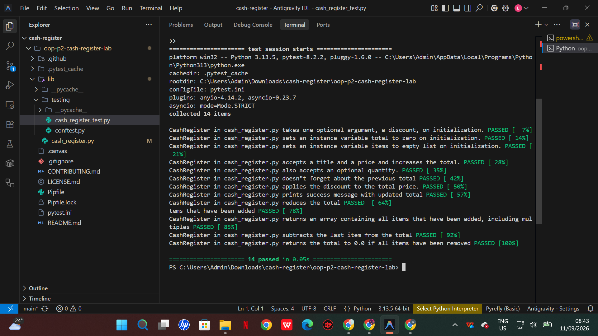

# Cash Register — Object Oriented Programming (OOP) Part 2

A `CashRegister` class that simulates the core functions of a cash register for an e-commerce site: ringing up items, applying a discount, and voiding the last transaction.

## Description

This project builds a `CashRegister` object with the following behavior:

- **Add items** to the register, optionally in bulk (`add_item(item, price, quantity)`).
- **Apply a discount** as a percentage off the current total (`apply_discount()`).
- **Void the last transaction**, removing it from the total and item list (`void_last_transaction()`).

### Attributes

| Attribute | Description |
|---|---|
| `discount` | Optional integer (0–100) passed on initialization. Defaults to `0`. Invalid values print `"Not valid discount"`. |
| `total` | Running total of the register. Starts at `0`. |
| `items` | Flat list of every item name added, repeated per quantity. |
| `previous_transactions` | Internal history of `add_item` calls, used to support voiding. |

### Methods

- `add_item(item, price, quantity=1)` — adds `price * quantity` to `total` and records the item(s) added.
- `apply_discount()` — reduces `total` by the stored discount percentage and prints a confirmation message, or a "no discount" message if `discount` is `0`.
- `void_last_transaction()` — reverses the most recent `add_item` call, restoring `total` and `items` to their prior state.

## Getting Started

### Setup

1. Fork and clone this repository.
2. Install dependencies:

```bash
pipenv install
pipenv shell
```

### Running the tests

Run pytest via:

```bash
pytest lib/testing/cash_register_test.py
```

All 14 tests should pass:



## Usage example

```python
from cash_register import CashRegister

register = CashRegister(20)               # 20% discount
register.add_item("macbook air", 1000)    # total -> 1000
register.apply_discount()                 # prints: After the discount, the total comes to $800.
register.void_last_transaction()          # total -> 0
```

## Project structure

```text
lib/
├── cash_register.py           # CashRegister implementation
└── testing/
    ├── cash_register_test.py  # test suite (autograded)
    └── conftest.py
```

## Maintenance notes

- No stale branches or commented-out code remain.
- No sensitive data is stored in this project; `.gitignore` covers standard Python/venv artifacts.

## Submission

This lab is graded automatically via CodeGrade based on the most recent commit pushed to GitHub. See the assignment page in Canvas for submission steps.
